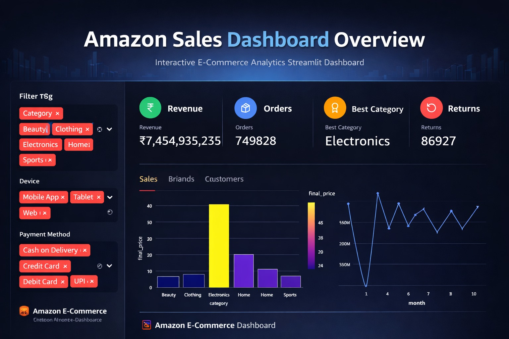
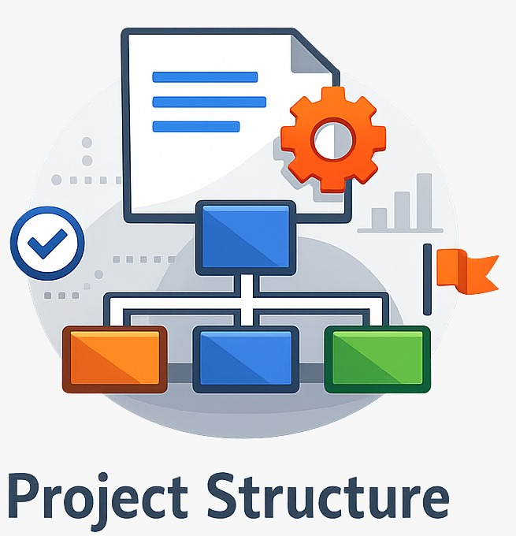
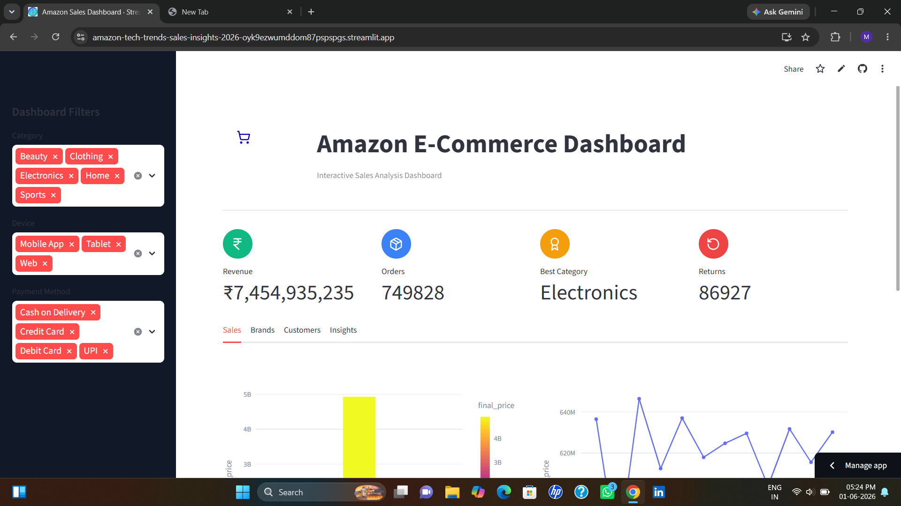
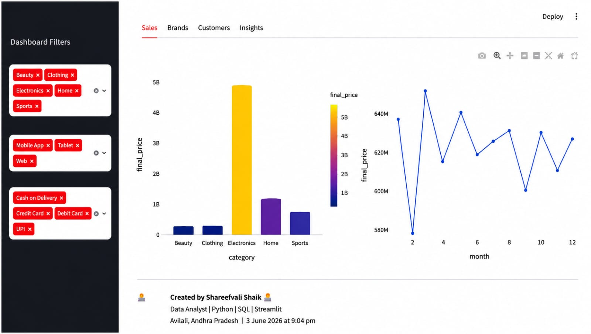
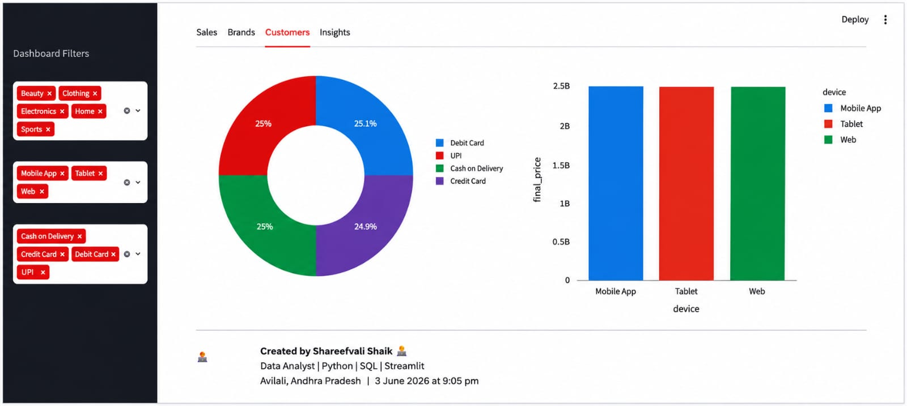
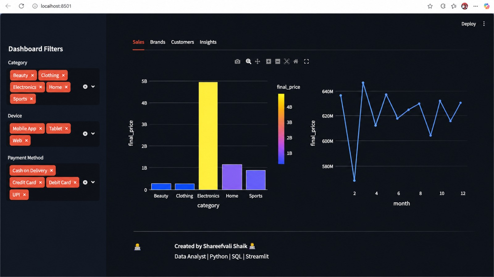
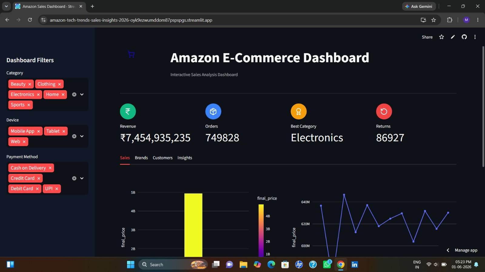
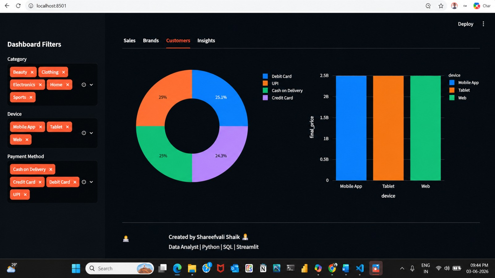

# 🛒 Amazon Tech Trends & Sales Insights 2026


An interactive data analytics dashboard built with Python, Streamlit, Pandas, and Plotly to analyze Amazon e-commerce sales performance, customer behavior, product trends, and business KPIs.

##  Live Demo

Dashboard: [Amazon Tech Trends & Sales Insights 2026](https://amazon-tech-trends-sales-insights-2026-oyk9ezwumddom87pspspgs.streamlit.app/?utm_source=chatgpt.com)

---

## Project Overview

This project simulates a real-world Amazon sales analytics solution used by business analysts and decision-makers to monitor:

* Revenue performance
* Product category trends
* Customer purchasing behavior
* Device usage patterns
* Payment method analysis
* Return rate monitoring
* Monthly sales trends
* Brand performance insights

The dashboard transforms raw sales data into actionable business insights through interactive visualizations and KPI tracking.

---

##  Business Objectives

* Identify top-performing product categories
* Monitor revenue growth trends
* Analyze customer purchasing patterns
* Evaluate payment preferences
* Track return rates and potential revenue loss
* Compare brand performance
* Support data-driven business decisions

---

## Technology Stack

| Technology      | Purpose                  |
| --------------- | ------------------------ |
| Python          | Data Processing          |
| Pandas          | Data Cleaning & Analysis |
| Streamlit       | Interactive Dashboard    |
| Plotly          | Data Visualization       |
| Requests        | Dynamic Icon Loading     |
| PIL (Pillow)    | Image Handling           |
| Git & GitHub    | Version Control          |
| Streamlit Cloud | Deployment               |

---

## Dashboard Features

### Executive KPI Dashboard

* Total Revenue
* Total Orders
* Best Selling Category
* Product Returns

### Sales Analysis

* Category-wise Revenue Analysis
* Monthly Sales Trends
* Revenue Distribution

### Brand Analytics

* Top Performing Brands
* Revenue by Brand

### Customer Analytics

* Device Usage Analysis
* Payment Method Insights
* Customer Purchase Behavior

### Business Insights

* Revenue Summary
* Category Performance
* Return Analysis

---

##  Dataset Information

The dataset contains Amazon e-commerce transaction records including:

* Purchase Date
* Product Category
* Brand
* Device Type
* Payment Method
* Final Price
* Return Status

Data cleaning includes:

* Missing value handling
* Duplicate removal
* Date conversion
* Data type optimization

---

## Key Insights Generated

* Best-performing product categories
* Monthly revenue patterns
* Most preferred payment methods
* Device-based purchasing trends
* Brand contribution to revenue
* Product return analysis

---

## 💻 Installation

Clone the repository:

```bash
git clone https://github.com/shareefvali786/Amazon-Tech-Trends-Sales-Insights-2026.git
```

Move into the project folder:

```bash
cd Amazon-Tech-Trends-Sales-Insights-2026
```

Install dependencies:

```bash
pip install -r requirements.txt
```

Run the application:

```bash
streamlit run Web_Page.py
```

---

## Project Structure

```text
Amazon-Tech-Trends-Sales-Insights-2026
│
├── Web_Page.py
├── amazon_sales.csv
├── analysis.py
├── Convert Raw Data.py
├── Connect to Database.py
├── requirements.txt
├── OIP.jpg
├── muninagaraju.png
└── README.md
```

---

## Dashboard Preview

Add screenshots of your dashboard here after deployment.

---

##  Future Enhancements

* Sales Forecasting using Machine Learning
* Customer Segmentation
* Product Recommendation System
* Inventory Analytics
* Real-Time Database Integration
* Advanced KPI Monitoring

---

# Author

**shareefvali shaik**

Data Analyst | Python | SQL | Power BI | Streamlit

GitHub: https://github.com/shareefvalishaik786

---
## 🎨 Theme Support

The dashboard automatically adapts to both Light and Dark themes.

### 🌞 Light Mode

#### Dashboard Overview


#### Sales Analysis


#### Customer Analytics


---

### 🌙 Dark Mode

#### Dashboard Overview


#### Sales Analysis


#### Customer Analytics

## ⭐ Support

If you found this project useful:

⭐ Star the repository

🍴 Fork the project

📢 Share with others

---

### Built with Python, Data Analytics, and Business Intelligence Concepts.
